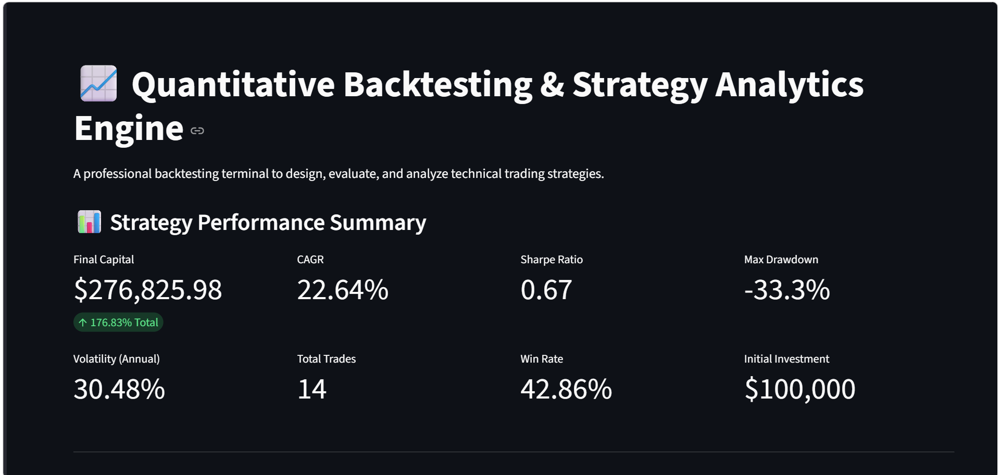
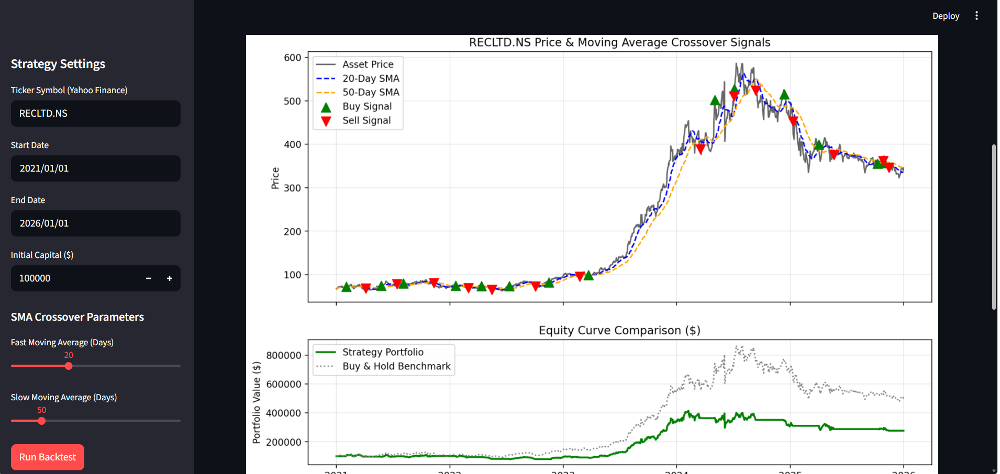
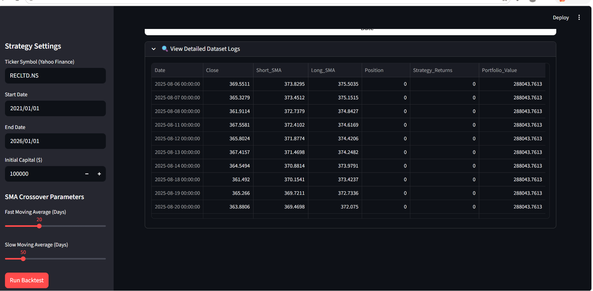

# Quant-Backtest-App
Production-grade quantitative trading strategy backtester and interactive analytics dashboard built using Python, Streamlit, and yfinance.
#  Quantitative Backtesting & Strategy Analytics Engine

A professional Streamlit quantitative analytics platform engineered to backtest technical trading strategies against historical equity data.

---

##  Dashboard Visuals

### Executive Performance KPI Metrics


### Strategy Signals & Equity Curve Charts


### Backtest Dataset Logs


---

##  Key Features
- **Dynamic Data Ingestion:** Automated ingestion of equity historical data via `yfinance` API.
- **Quantitative Engine:** Dual Moving Average Crossover strategy implementation with position signals.
- **Risk & Performance Analytics:** Real-time computation of CAGR, Sharpe Ratio, Annualized Volatility, Max Drawdown, and Win Rate.
- **Interactive UI:** Built with Streamlit for dynamic parameter adjustments.

---

##  Installation & Local Setup

1. **Clone the repository:**
   ```bash
   git clone [https://github.com/YOUR_USERNAME/quant-backtest-app.git](https://github.com/YOUR_USERNAME/quant-backtest-app.git)
   cd quant-backtest-app
